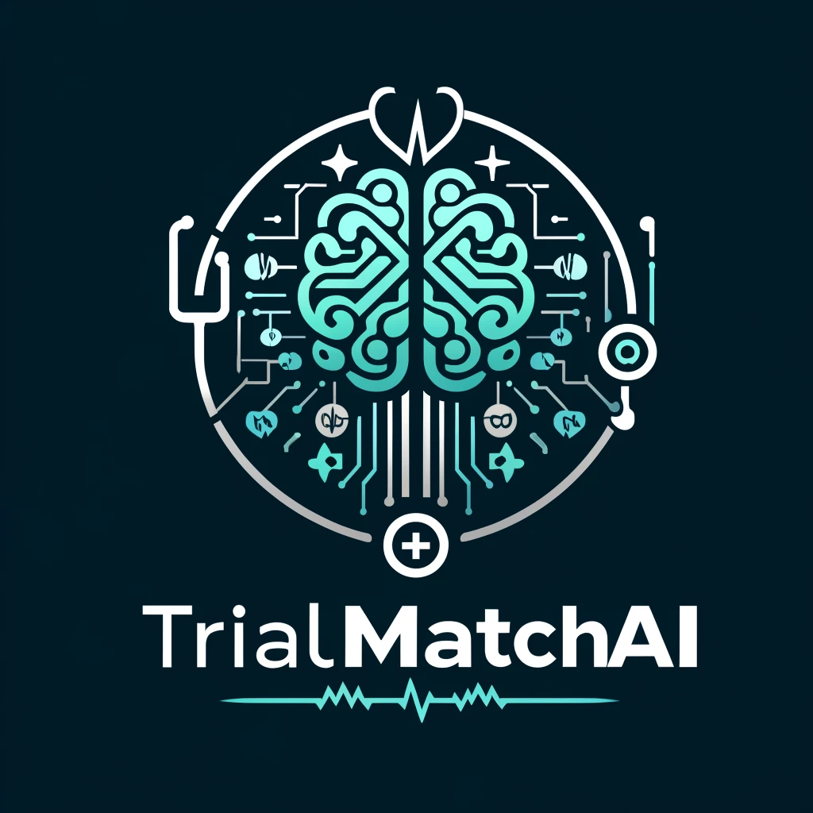

# TrialMatchAI  

TrialMatchAI is a tool designed to harness the capabilities of AI and Natural Language Processing (NLP) to generate personalized recommendations for clinical trials. Specifically designed for cancer patients, TrialMatchAI utilizes state-of-the-art techniques based on Large Language Models (LLMS) to parse and structure clinical texts, such as trial eligibility criteria, patient clinical notes, and genetic mutation reports. The tool uses AI-based information retrieval and NoSQL techniques to find optimal matches between patient profiles and clinical trials. The ultimate goal of TrialMatchAI is to streamline the process of identifying relevant and potentially beneficial clinical trials for individuals undergoing cancer treatment based on their unique genetic and clinical profiles.

## Key Features

### AI-Powered Recommendations
TrialMatchAI employs LLMs and advanced information retrieval techniques to parse and match clinical trial texts and clinical and genetic profiles of cancer patients. The pipeline of TrialMatchAI culminates in generating a personalized list of recommended clinical trials. Importantly, we employ Explainable AI (XAI) methodologies to elucidate and showcase the decision-making process behind the recommendations, enabling users to understand the rationale behind the recommended clinical trials.

### Personalized Matching
The tool prioritizes personalization, considering unique patient profiles to match them with clinical trials that align closely with their specific medical backgrounds and genetic markers.

### Streamlined Search Process
TrialMatchAI significantly enhances the efficiency of the trial discovery process, eliminating the arduous and increasingly impractical task of manually sifting through extensive databases. It provides concise and relevant trial recommendations promptly.

### Real-Time Updates
The tool updates its structured clinical trial data database, ensuring users can access the latest information on ongoing and upcoming clinical trials.

## How It Works

1. **Data Input**: Users provide a directory path to cancer patients' clinical and genetic profiles through a command-line interface. The profiles should preferably be in `.txt` or `.csv` formats.
2. **Analysis**: TrialMatchAI takes in this information and passes it through a modular pipeline that includes pre-processing, text parsing, post-processing, and match-finding steps.
3. **Recommendation Generation**: The tool generates a comprehensive list of recommended clinical trials along with trial-level highlights tailored to the individual's profile.

## Getting Started

To use TrialMatchAI, follow these simple steps:

1. **Install**: Download and install the tool.
2. **Input Patient Profiles**: Enter the clinical and genetic information of the cancer patient.
3. **Review Recommendations**: Access personalized recommendations for relevant clinical trials.

## Contributing

TrialMatchAI is an open-source project welcoming contributions from the community. Feel free to submit bug reports, feature requests, or code enhancements through our GitHub repository.

## Support

For any inquiries, support, or feedback, please get in touch at [abdallahmajd7@gmail.com].

## Disclaimer

TrialMatchAI is a tool designed as a mere search engine or assistant in identifying potential clinical trials. It is not, in any way, a substitute for professional medical and clinical advice. Patients and healthcare providers must always consult qualified medical professionals regarding treatment options.
